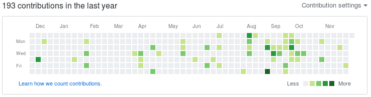

:title: Giving Back: A primer on helping open source projects
:author: Eric Poe <eric.poe@gmail.com>
:css: css/presentation.css

.. header::
  Developer Career Training: 2017 December 8

.. footer::
  "Giving Back: A primer on helping open source projects", Twitter: `@eric_poe <https://twitter.com/eric_poe>`_, Documentation License: `CC BY-SA 4.0 <https://creativecommons.org/licenses/by-sa/4.0/>`_

:id: start
:class: title

Giving Back
===========

A Primer on Helping Open Source Projects
----------------------------------------

----

:id: intro
:data-x: r0
:data-y: r1000

A Brief Presenter Introduction
==============================

.. note
  In my main job, I write sofware for scientists to use at a non-profit medical research institution.
  As part of that job, I might make contributions to open-source projects as long as that helps me do my job -- what kind of contributions, we'll cover later.

.. note
  I am the curriculum director for `Coder Dojo KC <http://coderdojokc.com/>`_ and a co-organizer of the `KC PHP User Group <https://www.meetup.com/kcphpug/>`_ .
  In those roles, I am taking advantage of many open source projects and, with the KC PHP User Group, I am taking part in the `PHP Test Fest <https://phptestfest.org/>`_ .

* Use open source tools on the job
* Volunteer as Curriculum Director for `Coder Dojo KC <http://coderdojokc.com/>`_
* Co-Organizer of `KC PHP User Group <https://www.meetup.com/kcphpug/>`_
* Creator of `Haystack <https://github.com/ericpoe/haystack>`_
* A contributor to open source projects

----

Target Audience
---------------

* Those who have never helped out an open-source project
* Those who would like to learn how to get started in helping out open-source projects

----

What We'll Cover
----------------

* What Is Open Source?
* Indirect Help
* Direct Help

  * Submit bug report
  * Submit feature request
  * Review pull requests
  * Make changes:

    * Learn how to contribute to a specific project
    * Submit documentation
    * Submit bug fix
    * Submit test
    * Submit feature

----

:id: what-is-open-source
:data-x: r1600
:data-y: r0

What is Open Source?
====================

Simply, open source software is software that has an license which allows for the source code to be freely distributed and modified, with proper attributions.
The nature of that distribution, modification, and attribution is defined in the license.

**See:** Open Source Initiative's Definition: https://opensource.org/osd

----

:data-x: r0
:data-y: r1000

Free
----

There are two types of free:

* *gratis*: No money exchanges hands

  * One can charge for open-source software
  * See: RedHat, Zend, & others

* *libre*: "Free, as in speech"

  * Libre software is what is meant by open-source.
  * All parties have access to the source code

----

:data-x: r1600
:data-y: r0

Indirect Help
=============

One can contribute to a project without ever submitting modifications to that project.

----

:data-x: r0
:data-y: r1000

Financial Help
--------------

Many projects are done on personal time and out of project.

You can help the developer(s) out through a financial reward or a gift.

* Some projects have a Patreon page or some other kind of "tip jar"
* Some developers accept gifts

  * Maybe there's an Amazon Wish-List
  * The gift could be unsolicited
  * **Example:** Derick Rethans, xDebug 15th Anniversary, and the community's gift of whisky: https://derickrethans.nl/xdebug-15.html

----

Spread the Word
---------------

Projects can live or die by how useful the developers find the project to themselves or to others.

* Tweet
* Blog
* Participate in forums
  * support forums
  * r/the-open-source-project
* Write
* Talk

----

:data-x: r1600
:data-y: r0

Direct Help
===========

Pull Request - Not Required
---------------------------

----

:data-x: r0
:data-y: r1000

Report a Bug
------------

Developers won't know a bug exists if they don't get feedback from their users

* Look on website for how to report bugs
* Go to the project's source code repository and use the bug-report link

  * Github
  * Gitlab
  * BitBucket

* Search the bugs to see if this bug has already been reported

  * If so, see if you can add any additional insight into the bug
  * Follow or subscribe to the bug to be alerted of comments or status changes

* Be polite!
* Don't use emotional language
* Be concise
* Include a breaking example & accompanying error messages
* Be prepared to respond to questions

----

Request a Feature
-----------------

This is similar to reporting a bug, but expect a larger turn-around time or a "no."

The same rules apply as reporting a bug.

* Some systems allow you to "upvote" a feature request.

----

Review Reports and Requests
---------------------------

* Reported bugs might have been resolved by time
* Requested features might not be wanted anymore
* Pull-requests could always use a review!
